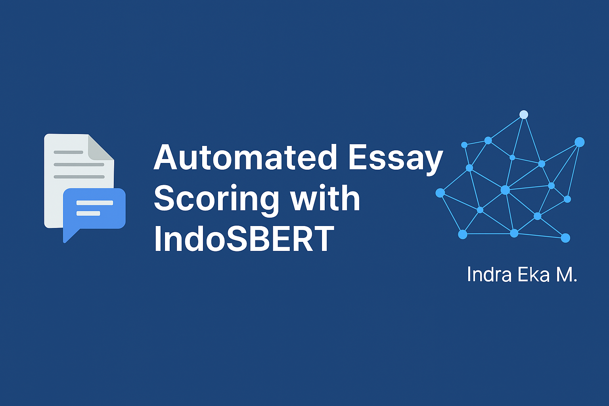

# ✍️ Automated Essay Scoring (Bahasa Indonesia) using IndoSBERT



This project builds an **automated essay scoring system** for Indonesian language answers using **IndoSBERT** for semantic similarity measurement.  
The model compares student-written answers against reference answers and predicts a score based on semantic closeness.

---


---

## 🎯 Objective

- Predict essay scores for Indonesian student answers
- Compare semantic similarity between student answer and reference key
- Use cosine similarity on sentence embeddings from **IndoSBERT**

---

## 🧠 Approach

- Preprocess text: lowercase, remove stopwords (Bahasa), punctuation, numbers
- Generate sentence embeddings using **sentence-transformers** (`indobert-base-p1`)
- Use cosine similarity to score answers
- Evaluate using MAE, RMSE, and correlation metrics

---

## 📂 Project Structure

```
AutomatedEssay_indoSBERTok.ipynb
Data/
├── Data.xlsx  ← Contains "Answer Key", "Student Answer", and "Score"
assets/
├── aes-indosbert-banner.png
```

---

## 🚀 How to Run

1. Run the notebook in **Google Colab**
2. Mount Google Drive and point to the dataset
3. Preprocess the data
4. Run scoring and evaluation cells

---

## 📊 Evaluation Metrics

- **Cosine Similarity**
- **RMSE** (Root Mean Squared Error)
- **MAE** (Mean Absolute Error)
- **Pearson Correlation** with ground truth scores

---

## 👨‍💻 Author

**Indra Eka Mandriana S.Kom**  
_Natural Language Processing & Language Education Tech Researcher_

---

## ⭐ Found it useful? Star this project on GitHub!
